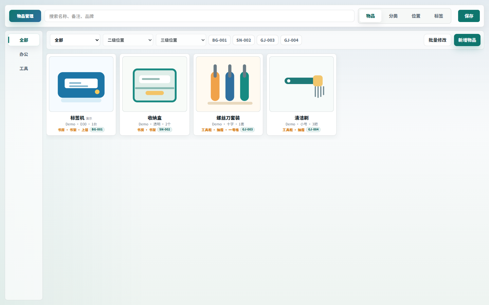
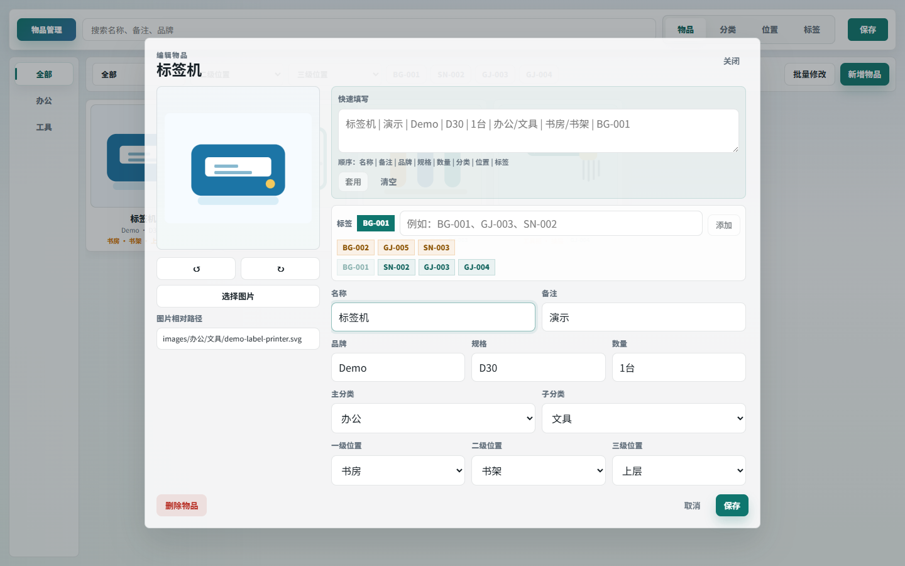
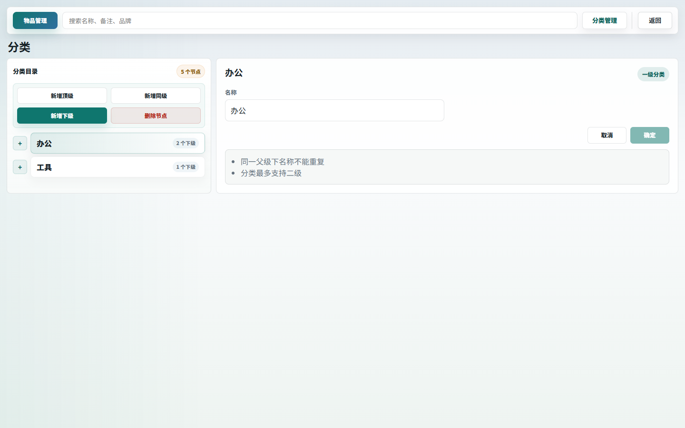
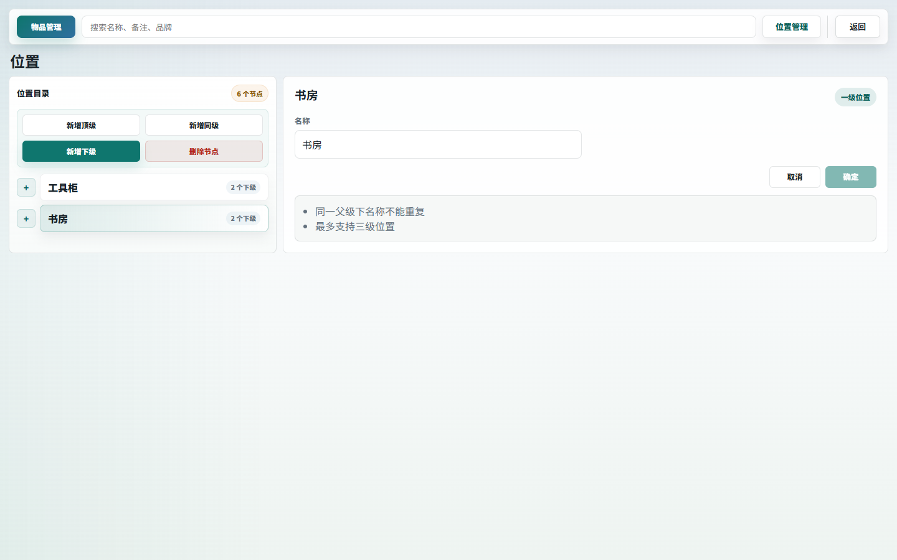
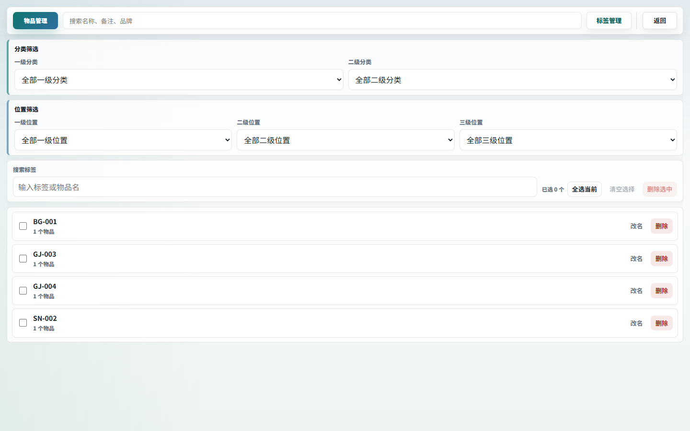

# Item Manager

[中文](README.md)

A local desktop app for personal item tracking. It stores items, images, categories, locations, tags, and quantities in the `data` folder next to the executable. No browser, server, or remote database is required.

README screenshots use `docs/demo-data/project.json` demo data and do not include private item data.



## Download

Download the latest Windows build from [Releases](https://github.com/cimorn/ItemManager/releases).

File name format:

```text
ItemManager-V26.07.05.exe
```

Put the exe in a fixed folder and run it. The app uses or creates a sibling `data` folder.

## Usage

1. Open `ItemManager-V26.07.05.exe`.
2. Click `新增物品` to add an item.
3. Fill in the name, brand, specification, quantity, category, and location.
4. Choose an image. Images are stored under `data/images/category/subcategory/file-name`.
5. Add tags such as `BG-001`, `GJ-003`, or `SN-002`.
6. Click `保存`; the app writes data to `data/project.json`.



## Data Folder

Default layout:

```text
dist/
  ItemManager-V26.07.05.exe
  data/
    project.json
    images/
      服装/鞋子/...
      数码/设备/...
    backups/
    exports/
```

Most data is stored in `data/project.json`. Images are under `data/images`, backups under `data/backups`, and Excel exports under `data/exports`.

The `docs/demo-data` folder only supports README screenshots. It does not replace your local `data` folder.

## Categories And Locations

Categories use two levels. Locations use up to three levels, so they can describe rooms, cabinets, boxes, or drawers.





## Tags

Tags are item or box labels. You can filter by category, location, and tag, then rename or delete tags in batches.



## Features

- Items: browse, search, filter, and edit items.
- Categories: manage main categories and subcategories.
- Locations: manage three-level storage locations.
- Tags: view, filter, rename, and delete labels.
- Batch edit: update categories, locations, or tags for multiple items.
- File tools: new, open, save as, import Excel, export Excel, and export data backups.
- Automatic backup: local backups are kept before saving.

## Development

```bash
pnpm install
pnpm test
pnpm run build:desktop
```

The packaged exe and `data` folder are flattened directly under `dist`.

## License

MIT
